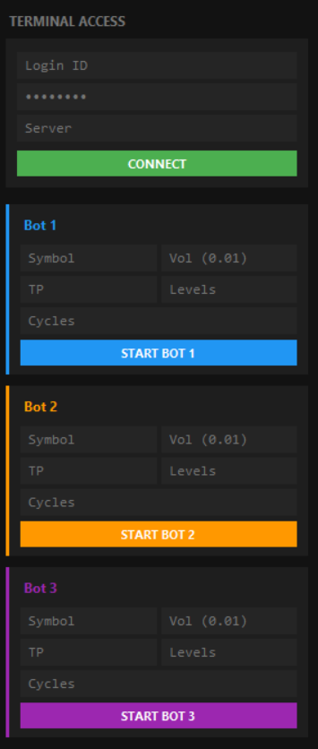
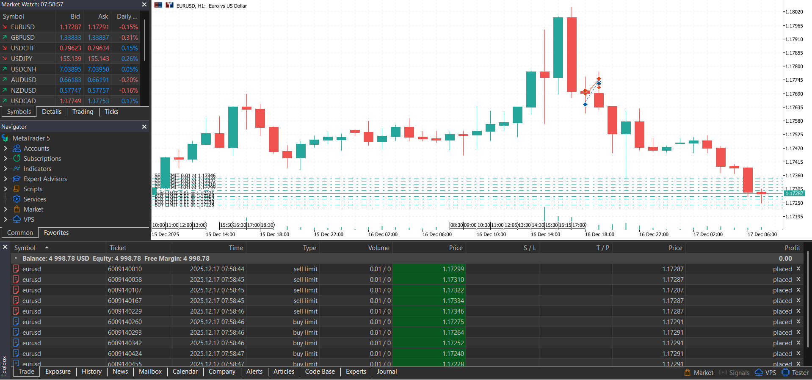

# Forex Grid Master 🤖📈

Forex Grid Master is an automated **grid-based forex trading bot** developed using **Python** and the **MetaTrader 5 (MT5) library**.  
This project focuses on algorithmic trading concepts such as grid strategies, automated order execution, and trade management.

⚠️ This project is intended **for educational and experimental purposes only**.

---

## 🖼️ Program Screenshots

### ▶️ Bot Startup (Terminal)
The bot starts execution and initializes the trading strategy.

---

### 🔌 MetaTrader 5 Connection
Successful connection to the MT5 terminal and trading account.

---

### 📊 Grid Trades Opened
Multiple buy/sell orders placed automatically based on the grid strategy.

## 🚀 Features

- 📊 Grid trading strategy implementation  
- 🤖 Automated Buy/Sell limit order execution  
- 🔄 Manages multiple open positions  
- ⏱️ Real-time market monitoring  
- 🧠 Rule-based trading decisions  
- 🖥️ Integration with MetaTrader 5  
- 📁 Clean and modular Python structure  

---

## 🛠️ Technologies Used

- **Python 3**
- **MetaTrader 5 (MT5) Python API**
- Object-Oriented Programming (OOP)
- Algorithmic trading concepts
- Threading

